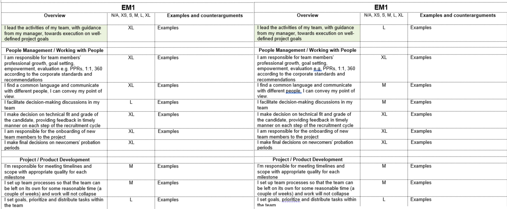

# How to Use the Grading System for Engineering Managers

:zero: *Grades assessment* is a part of the PPR. You can run this on demand during your one-on-one meetings with your manager, however, you can get a level upgrade not more than once a year.
    
:one: *The process*:

- Download the R&D Engineering Managers PPR form to your computer and fill it using Microsoft Word.
  - Start with reviewing the description of your current grade and see what needs to be done to reach the next one.
- Self-assessment document description:
  - It contains the list of the skills required for each of the grades from EM1 to EM3.
  - Dropdowns have a T-shirt model to evaluate each point:
	- N/A - not applicable,
    - XS - very little/very rarely,
    - S - little/rarely,
    - M - average,
    - L - much/often,
    - XL - very much/very often,
    - When choosing a value for each position, rely on the real situation (I do it) and not on the potential (I could do).
  - Ground rules for Self-assessment template:
    - A dropdown for every line - *no empty cells should remain*.
    - Your mark should be at least an L in the "Overview" (green cell in the table) to be fit for the grade.
    - English language level must not be lower than expected for your current grade/grade you are applying for.
    - You should fill in the "Examples" section. *No positions without examples/arguments should remain*.
    - If you have at least one M in the "Behavior to avoid" section, consider this a blocker. Please improve and come back in a while.
      - For the Managers: please look through the "Behavior to avoid" sections in the lower Grades. If the employee has something above an S, it should be discussed and included in their Personal Development Plan.	
    
:exclamation: For an initial grading:
- The Manager fills out the table mentioned above (including "Examples") and then passes it to the Employee.
- The Employee adds examples to the table.
- The Manager and the Employee discuss the result in the meeting as described in the step 2 below.  
      
:two: Check whether your self-assessment matches your Manager’s assessment:

   - Your Manager fills out the same assessment template from their perspective before the review date.
   - Share access to your table with the Manager. The Manager should share a screen with 2 tables next to each other.
    
   - Discuss the result with your Manager.
   - Reach an agreement on the result.

    
:three: If after the discussion you feel like you deserve an upgrade:

- And your Manager has the same opinion:
  - Congrats! You have moved to the upper grade.
- But your Manager doesn't agree with you:
  - You need to jointly draw up a development plan with action points to accomplish for your upgrade.  

:four: Outcome of the Grade meeting: A Personal Development Plan.

:five: Who makes the final decision?

- The final decision is made by the Manager, it is their responsibility.

:six: What should you do if you disagree with the decision on your grade?
- Discuss your concerns with the Manager.
- Understand what their opinion is and what should be done to reach the next level.
- If you can’t find common ground with your Manager, you have an option to involve the Grades Committee to join this discussion. Make sure there are reasons to do it and prepare strong arguments.

:exclamation: For the Managers! When you reach the agreement on the content of the PPR form, upload the final version of the form to the HRBO:
- Delete unfilled E[n] pages.
- Upload the resulting file to HRBO:
  - as PPR results if Grading was done as a regular PPR,
  - as Grading results if Grading was performed between/aside from PPR process.
