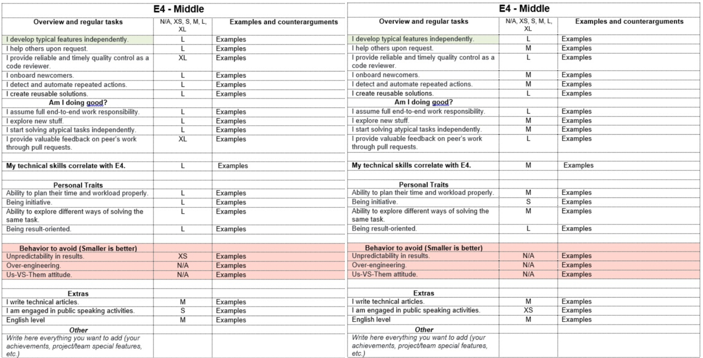

# How to Use the Grading System for Engineers

:zero: *Grades assessment* is a part of the PPR. You can run this on demand during your one-on-one meetings with your manager, however, you can get a level up not more than once every six months.

    
:one: *The process*:

- Download the R&D Engineers PPR form to your computer and fill it out using Microsoft Word.
  - Start with reviewing the description of your current grade and see what needs to be done to reach the next one.
- Grades self-assessment template description:
  - It contains the list of the skills required for each of the grades from E1 to E7.
  - Dropdowns have a T-shirt model to evaluate each point:
    - N/A - Is not applicable or equals 0
      - Did not participate in activity (The reason is described in the comments).
    - XS - Room for improvement
      - Did it only 1 time.
      - Results are never achieved in time and are with low-quality.
    - S - On the Way
      - Activity is rarely performed.
      - Results are either achieved in time OR with satisfying quality, but not both.
    - M - Meets Expectations
        - Performs the activity in a regular manner.
        - Results are achieved in time AND with satisfying quality.
    - L - Exceeds Expectations
      - Proactive in this activity, do it pretty often.
      - Always achieves results on time and with excellent quality, with no pushing or guidance required.
    - XL - Outstanding Performance
      - Leads the activity, being one of the best in the company.
      - Results are outstanding, clearly contributing to the overall success of the organization, and having a measurable impact on the company's key goals.  
    - When choosing a value for each position, rely on the real situation (I do it) and not on the potential (I could do it). NOTICE: Behavior to avoid is evaluated in the opposite way – the smaller is better.
  - Ground rules for Self-assessment template:
    - Choose a dropdown for every line, *no empty cells should remain*.
    - Your mark should be at least an L in the first line of "Overview and regular tasks" (green cell in the table) to be fit for the grade.
      - We expect most of the other lines in "Overview and regular tasks" of your current grade will be at least an M. However, this is not a blocker.
    - Fill out the "Examples" section. *No positions without examples/arguments should remain*.
    - If you have at least one M in the "Behavior to avoid" section, consider this a blocker. Please improve and come back in a while.
      - For the Managers: please look through the "Behavior to avoid" sections in the lower grades. If the Employee has something above an S, it should be discussed and included in their Personal Development Plan.	
- For tech skills assessment use the [Technical Development Roadmap](https://docs.google.com/spreadsheets/d/1g3lsqXwZzOvBu3MI7zOL0vNstbvqIGpCe479ZVBwfA4/edit?usp=sharing).
  - We expect an M level of technical knowledge for your level.
  - Сompliance with the level of technical skills is a necessary but not sufficient condition for a certain grade.
  - A set of necessary technical skills is discussed with the Manager and included in the Personal Development Plan based on the results of the assessment.
    
:exclamation: For an initial grading:
- The Manager fills out the table mentioned above (including "Examples") and then passes it to the Employee.
- The Employee adds examples to the table.
- The Manager and the Employee discuss the result in the meeting as described in the step 2 below.  
      
:two: Check whether your self-assessment matches your Manager’s assessment:

   - Your Manager fills out the same assessment template from their perspective before the review date.
   - Share access to your table with the Manager. The Manager should share a screen with 2 tables next to each other.

   

   - Discuss the result with your Manager.
   - Reach an agreement on the result.

    
:three: If after the discussion you think you deserve an upgrade:

- And your Manager has the same opinion:
  - Congrats! You have moved to the upper grade.
- But your Manager doesn't agree with you:
  - You need to jointly draw up a development plan with action points to accomplish for your upgrade.  

:four: Outcome of the Grade meeting: A Personal Development Plan.

:five: Who makes the final decision?

- The final decision is made by the Manager, it is their responsibility.
  - If the Manager has a different competency than the developer they are assessing, the Manager can ask the Head of the competency to invite a Manager of the required competency to assess Employee's technical skills.	

:six: What should I do if I disagree with the decision on my grade?
- Discuss your concerns with the Manager.
- Understand what their opinion is and what should be done to reach the next level.
- If you can’t find common ground with your Manager, you have an option to involve the Grades Committee to join this discussion. Make sure there are reasons to do it and prepare strong arguments.

:exclamation: For the Managers! 
When you reach the agreement on the content of the PPR form, upload the final version of the form to the HRBO:
- Delete unfilled E[n] pages,
- Upload the resulting PPR form to HRBO,
- Upload to the HBRO the filled Technical Roadmap in excel along with the PPR form.

